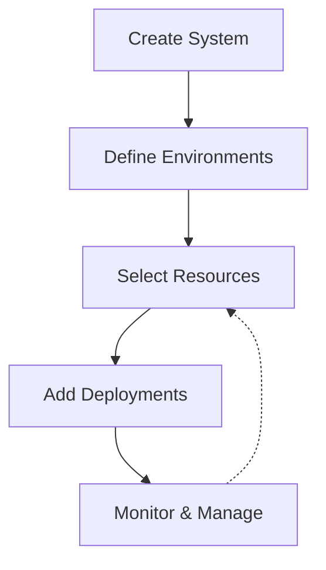

<iframe
  className="w-full aspect-video"
  src="https://www.youtube.com/embed/Ezn9EFeH7Es"
  frameborder="0"
  allowfullscreen
/>

## What are Systems?

Systems in Ctrlplane are organizational units that group related deployments,
environments, and resources. Think of a system as a logical container for an
application or service that needs to be deployed and managed across your
infrastructure.

Systems help you organize your deployments into meaningful groups, making it
easier to manage complex infrastructure and application landscapes.

## Key Characteristics

Each system in Ctrlplane has:

- **Name**: A human-readable identifier
- **Slug**: A URL-friendly identifier for the system
- **Description**: Information about what the system contains or represents
- **Workspace**: Each system belongs to a specific workspace

## Why Use Systems?

Systems provide several benefits:

- **Organization**: Group related deployments logically
- **Navigation**: Easily find and manage related components
- **Consistency**: Apply shared configurations across related deployments
- **Visibility**: See metrics and status across a complete application
- **Access Control**: Manage permissions at a system level

## How Systems Relate to Other Components

### Systems and Deployments

Each system can contain multiple deployments. Deployments within a system
typically represent different components or services that are part of the same
application.

For example, a "Customer Portal" system might include deployments for:

- Frontend web application
- Authentication service
- Customer data API
- Analytics dashboard

### Systems and Environments

Systems work with environments to create a matrix of deployment targets. An
environment (like "Development" or "Production") can be applied across multiple
systems.

This allows you to:

- Deploy a system to different environments
- Apply consistent environment policies across systems
- Track system performance in each environment

### Systems and Resources

Resources (like Kubernetes clusters, VMs, or databases) can be selected by
deployments within a system. This creates a connection between logical systems
and the physical/virtual infrastructure they run on.

## System Lifecycle

## Getting Started with Systems

1. **Create a new system** with a descriptive name
2. **Define environments** for the system (like dev, staging, production)
3. **Create deployments** within the system
4. **Select resources** that deployments will target
5. **Monitor system health** across environments

Systems are a foundational concept in Ctrlplane that help you organize your
infrastructure in a way that matches your business needs and application
architecture.
