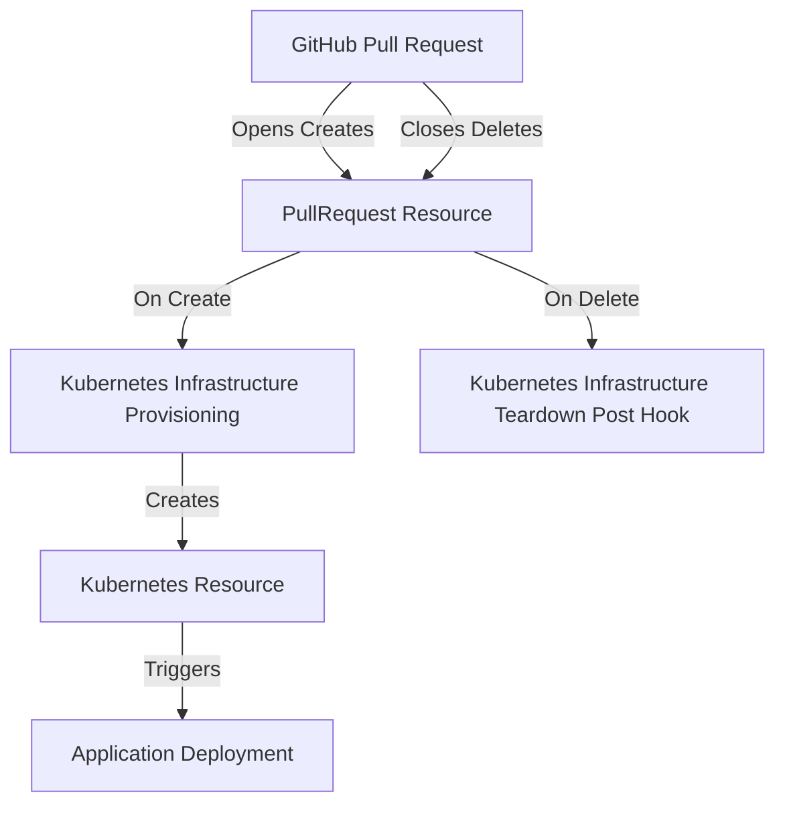

## Determining if you need an ephemeral environment

Here are some key questions to help determine if ephemeral environments would benefit your workflow:

<AccordionGroup>
  <Accordion title="Do you need isolated testing environments?">
    If your team needs to test features in isolation without impacting other developers or staging environments, ephemeral environments allow you to spin up dedicated environments on-demand.
  </Accordion>

<Accordion title="Are your environments complex to set up?">
  When environments require multiple services, databases, and configurations to
  be set up, ephemeral environments can automate this process and ensure
  consistency.
</Accordion>

<Accordion title="Do you have high infrastructure costs?">
  If maintaining multiple long-running environments is costly, ephemeral
  environments can help reduce costs by only running when needed and
  automatically cleaning up unused resources.
</Accordion>

<Accordion title="Do you need to test branch-specific changes?">
  Ephemeral environments make it easy to test changes from specific branches by
  creating isolated environments that match your branch configuration.
</Accordion>

  <Accordion title="Is your team growing?"> As teams scale, coordinating
    environment usage becomes more challenging. Ephemeral environments give each
  developer or team their own space to work without interference. </Accordion>
</AccordionGroup>

If you answered yes to any of these questions, implementing ephemeral
environments could significantly improve your development workflow.

## Scenario

A development team needs to test feature branches in isolated environments
before merging to main. Each developer needs:

- A complete replica of the production environment
- Automatic cleanup when pull requests are merged
- Cost optimization for cloud resources
- Integration with their CI/CD pipeline

In this example we will be using the following technologies

- Github Actions for CI/CD
- Kubernetes (GKE) for containerization

We are going to deploy a simple nginx application to the cluster and then test
it.

Here is a high level overview of the workflow:



## 1. Pull Request Resource Creation

When using Ctrlplane for any system, you must first determine what resources
represent the the existance of your deployment.

In this case, we will use the GitHub pull request to determine if the ephemeral
environment should be created and when it should be destroyed.

This means Ctrlplane will follow the lifecycle of the pull request - creating
the environment when the PR is opened and destroying it when the PR is merged or
closed.

todo this we will need to create a Github that tracks and updates resources in
ctrlplane as pull requests state changes.

Here is what it does:

1. When a pull request is opened or reopened:

   - Creates/updates a resource in Ctrlplane with metadata about the PR
   - Includes details like repository, branch, PR number, and author
   - Links back to the GitHub PR for reference

2. When a pull request is closed:
   - Automatically deletes the corresponding resource from Ctrlplane
   - Helps clean up any associated ephemeral environments

```yaml .github/workflows/create-git-resource.yml
name: Git Ref Resource Action
concurrency:
  group: ${{ github.event.pull_request.number || github.ref }}
  cancel-in-progress: false

on:
  pull_request:
    types: [opened, closed, reopened]

jobs:
  git-ref-target:
    runs-on: ubuntu-latest
    steps:
      - name: Install Ctrlplane CLI
        uses: ctrlplanedev/cli@main
        with:
          workspace: ${{ secrets.CTRLPLANE_WORKSPACE_ID }}
          api_key: ${{ secrets.CTRLPLANE_API_KEY }}

      - name: Create Resource for Pull Request
        if: github.event_name == 'pull_request' && (github.event.pull_request.state == 'open' || github.event.pull_request.state == 'reopened')
        run: |
          ctrlc api upsert resource \
            --version "github/v1" \
            --kind "PullRequest" \
            --identifier "github/${{ github.event.repository.owner.login }}/${{ github.event.repository.name }}/${{ github.event.pull_request.number }}" \
            --name "${{ github.event.repository.name }}/${{ github.event.pull_request.head.ref }}" \
            --config "type=github" \
            --config "branch=${{ github.event.pull_request.head.ref }}" \
            --config "repo=${{ github.event.repository.owner.login }}/${{ github.event.repository.name }}" \
            --config "pullRequest=${{ github.event.pull_request.number }}" \
            --metadata "github/repo=${{ github.event.repository.owner.login }}/${{ github.event.repository.name }}" \
            --metadata "github/pull-request=${{ github.event.pull_request.number }}" \
            --metadata "git/branch=${{ github.event.pull_request.head.ref }}" \
            --metadata "git/repo=${{ github.event.repository.owner.login }}/${{ github.event.repository.name }}" \
            --metadata "git/author=$(git log -1 --pretty=format:%an)" \
            --metadata "git/author-email=${{ github.event.pull_request.head.user.email }}" \
            --link "GitHub Pull Request=https://github.com/${{ github.event.repository.owner.login }}/${{ github.event.repository.name }}/pull/${{ github.event.pull_request.number }}"

      - name: Delete Resource
        if: github.event_name == 'pull_request' && github.event.pull_request.state == 'closed'
        run: |
          ctrlc api delete resource \
            --identifier "github/${{ github.event.repository.owner.login }}/${{ github.event.repository.name }}/${{ github.event.pull_request.number }}"
```

## 2. Infrastructure Creation

Once the pull request resource is created, we now determine what pipelines need
to be take give the state of the Pull Request. In our scenario we will create a
GKE cluster for each PR.

```yaml .github/workflows/deploy-gke-cluster.yml
name: Deploy GKE Cluster
run-name: Deploy GKE Cluster [${{ inputs.job_id }}]

on:
  workflow_dispatch:
    inputs:
      job_id:
        description: "Job ID"
        required: true

jobs:
  create-gke:
    runs-on: ubuntu-latest
    steps:
      - name: Authenticate to Google Cloud
        uses: google-github-actions/auth@v1
        with:
          credentials_json: ${{ secrets.GCP_SA_KEY }}

      - name: Set up Cloud SDK
        uses: google-github-actions/setup-gcloud@v1

      - id: ctrlplane
        uses: ctrlplanedev/ctrlplane/github/get-job-inputs@main
        with:
          job_id: ${{ inputs.job_id }}
          api_key:
            ${{ secrets.CTRLPLANE_API_KEY }}
            # the pull request number, this was set in the config body
            # when creating the pull request resource:
            # `--config "pullRequest=${{ github.event.pull_request.number }}"`
          required_outputs: |
            resource_config_pullRequest

      - name: Install Ctrlplane CLI
        uses: ctrlplanedev/cli@main
        with:
          workspace: ${{ secrets.CTRLPLANE_WORKSPACE_ID }}
          api_key: ${{ secrets.CTRLPLANE_API_KEY }}

      - name: Create GKE Cluster
        run: |
          # Create a unique cluster name based on PR
          CLUSTER_NAME="pr-${{ outputs.ctrlplane.resource_config_pullRequest }}"
          REGION="us-central1"

          # Create GKE cluster
          gcloud container clusters create $CLUSTER_NAME \
            --region $REGION \
            --num-nodes 1 \
            --machine-type e2-standard-2

          # Get cluster credentials
          gcloud container clusters get-credentials $CLUSTER_NAME --region $REGION

          # Create Ctrlplane resource for the cluster
          ctrlc api upsert resource \
            --version "gke/v1" \
            --kind "Cluster" \
            --identifier "gke/$CLUSTER_NAME" \
            --name "$CLUSTER_NAME" \
            --config "project=${{ secrets.GCP_PROJECT_ID }}" \
            --config "region=$REGION" \
            --config "cluster=$CLUSTER_NAME" \
            --metadata "pr=${{ github.event.pull_request.number }}" \
            --metadata "branch=${{ github.event.pull_request.head.ref }}" \
            --link "GCP Console=https://console.cloud.google.com/kubernetes/clusters/details/$REGION/$CLUSTER_NAME"
```

<Note>
  If you wanted to speed up the creation of the cluster, you could instead
  deploy to a namespace in an existing cluster.
</Note>

## 3. Application Deployment

Lets create a new github action that will deploy our Nginx application to the cluster.

```yaml .github/workflows/deploy-nginx.yml
name: Deploy Nginx
run-name: Deploy Nginx [${{ inputs.job_id }}]

on:
  workflow_dispatch:
    inputs:
      job_id:
        description: "Job ID"
        required: true

jobs:
  deploy-nginx:
    runs-on: ubuntu-latest

    steps:
      - name: Deploy Nginx using Helm
        run: |
          helm repo add bitnami https://charts.bitnami.com/bitnami
          helm repo update
          helm upgrade --install nginx bitnami/nginx \
            --namespace ${{ secrets.NAMESPACE }} \
            --set service.type=LoadBalancer
```

## 4. Infrastructure Teardown
