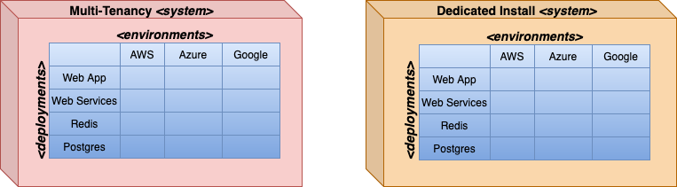

## What ctrlplane does

`ctrlplane` excels in orchestrating an organization's _digital assets_. Digital assets 
can any software, configuration or cloud infrastructure. Examples:
* cloud managed infrastructure (databases, clusters, etc)
* custom software deployed on a server
* a code repository
* a directory of log files

# Organizing the Orchestration

## Workspaces

As an organization administrator, I must create a _workspace_ to orchestrate changes to my 
digital assets. This is the top-level abstraction in `ctrlplane`.

## Systems

It is useful, and also required in `ctrlplane` to create a _system_ to isolate the management of
digital assets. The breakdown into systems is flexible and may based on any number of factors.

As someone responsible for code rollouts and its related infrastructure in a particular business unit,
I could create a _system_ of based on business domain.

Alternatively, if I am primary responsible for infrastructure (and not code rollouts), I could create 
a _system_ as a place for all databases, object stores, etc. across the organization.

The use case we'll use is another option. We have **multi-tenant** version of our product that is 
a standard offering as well as dedicated installations for some customers.  A **dedicated install** 
must support infrastructure customization to allow integrations across our and their cloud 
accounts (shared object store, network connectivity, etc). Due to the complexity and number of 
dedicated installations, we have a separate group that is in charge of those installations.

## Environments

Even in a single-cloud infrastructure, there will likely multiple _environments_: QA, PROD, etc. In a
multiple-cloud, it gets more complex: AWS-QA, Azure-QA, GCP-QA, AWS-PROD, Azure-PROD, GCP-PROD etc.

Our use case will use be multi-cloud, but for simplicity, we won't specify QA, PROD, etc. Therefore, our
_environments_ will be AWS, Azure and GCP.

## Deployments

The final abstraction in a system is a _deployment_. There are different ways to think about a deployment, but a
good heuristic for `ctrlplane` is that a _deployment_ is something that is pushed out with a specific version
and configuration.

Our example will use a contrived set of: Web UI, Web Services, Redis, and Postgres. Any of these can get pushed
out with their own configuration and version, and each may be done independently of the other.

The resulting model of systems, environments and deployments is shown below:

To affect digital assets, however, `ctrlplane` requires integrations to the outside. 

# Integration to the Outside

Broadly, two types of _integrations_ are required: 
* _input_ from by scanning what infrastructure is available
* _output_ to trigger changes by pushing out digital assets

To gather _output_, I must create at least one _Job Agent_ to trigger the updates. An example is a 
Github Agent that triggers Github Actions.

To gather _input_, I must also set up at least one _Resource Provider_ to detect what available 
infrastructure. In `ctrlplane` terminology these scan for available _resources_. A resource 
can be any number of things: a Kubernetes cluster in a cloud provider, a physical server, 
a Terraform workspace, a VPC or even something as small as an AWS Lambda. 

Some Resource Providers run inside `ctrlplane`. For AWS, Azure and GCP, we are able to do this because
we can create a secure trust relationship that we can share with `ctrlplane`. 
These are referred to as a _managed_ RPs. 

There are cases where no secure trust relationship is available. For example, integration is with an API
key. For those cases it is a best practice to keep connection credentials and, consequently, the Resource
Provider, outside of `ctrlplane`. We refer to it as an _unmanaged_ RP since `ctrlplane` has no control 
over its execution.

